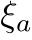
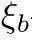
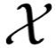
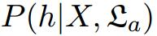
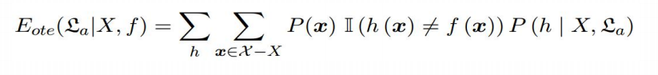
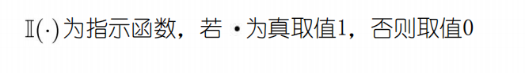
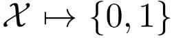
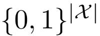
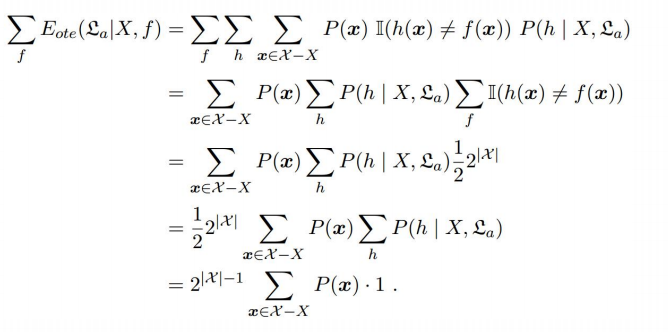

# 1.1机器学习的定义

计算机学习数据，生成一个算法模型，在面对新的情况下，计算机便能做出有效判断，

Mitchell给出的形式化定义,假设：

- P：计算机程序在某任务类T上的性能。、

- T：计算机程序希望实现的任务类。

- E：表示经验，即历史的数据集。

若该计算机程序通过利用经验E在任务T上获得了性能P的改善，则称该程序对E进行了学习。

# 1.2机器学习基本术语

实例数据：（色泽=青绿;根蒂=蜷缩;敲声=浊响)， (色泽=乌黑;根蒂=稍蜷;敲声=沉闷)， (色泽=浅自;根蒂=硬挺;敲声=清脆)

- 所有记录的集合为：数据集

- 每一条记录为：一个实例(instance) 或样本(sample)。

- 例如：色泽或敲声，单个的特点为特征(feature)或属性(attribute)。

- 对于一条记录，如果在坐标轴上表示，每个西瓜都可以用坐标轴中的一个点表示，即特征向量(feature vector)。

- 一个样本的特征数：维数(dimendionality)，该西瓜的例子维数为3，当维数非常大时，也就是现在说的”维数灾难“。

计算机程序学习经验数据生成算法模型的过程中，每一条记录称为一个“训练样本”，同时在训练好模型后，我们希望使用新的样本来测试模型的效果，则每一个新的样本称为一个“测试样本”。定义：

- 所有训练样本的集合为： 训练集(training set),[特殊]。
- 所有测试样本的集合为： 测试集(test set),[一般]。
- 机器学习出来的模型适用于新样本的能力为：泛化能力（generalization），即从特殊到一般。

西瓜的例子中，我们是想计算机通过学习西瓜的特征数据，训练出一个决策模型，来判断一个新的西瓜是否是好瓜。可以得知我们预测的是：西瓜是好是坏，即好瓜与差瓜两种，是离散值。同样地，也有通过历年的人口数据，来预测未来的人口数量，人口数量则是连续值。定义：

- 预测值为离散值的问题：分类(classification)。
- 预测值为连续值的问题： 回归(regression)。

我们预测西瓜是否是好瓜的过程中，很明显对于训练集中的西瓜，我们事先已经知道了该瓜是否是好瓜，学习器通过学习这些好瓜或差瓜的特征，从而总结出规律，即训练集中的西瓜我们都做了标记，称为标记信息。但也有没有标记信息的情形，例如：我们想将一堆西瓜根据特征分成两个小堆，使得某一堆的西瓜尽可能相似，即都是好瓜或差瓜，对于这种问题，我们事先并不知道西瓜的好坏，样本没有标记信息。定义：

- 训练数据有标记信息的学习任务为：监督学习（supervised learning），容易知道上面所描述的分类和回归都是监督学习的范畴。
- 训练数据没有标记信息的学习任务为：无监督学习（unsupervised learning），常见的有聚类和关联规则

# 1.3归纳偏好

## 1.3.1定义

学习过程中对某种类型假设的偏好称作归纳偏好，归纳偏好可看作学习算法自身在一个可能很庞大的假设空间中对假设进行选择的启发式或“价值观”.

## 1.3.2奥卡姆剃刀

- “奥卡姆剃刀”是一种常用的、自然科学研究中最基本的原则，即“若有多个假设与观察一致，选最简单的那个”.

- “奥卡姆剃刀”是一种常用的、自然科学研究中最基本的原则，即“若有多个假设与观察一致，选最简单的那个”.
- 具体的现实问题中，学习算法本身所做的假设是否成立，也即算法的归纳偏好是否与问题本身匹配，大多数时候直接决定了算法能否取得好的性能.

## 1.3.3NoFreeLunch

一个算法 如果在某些问题上比另一个算法 好，必然存在另一些问题比 好,也即没有免费的午餐定理。

简单起见，假设样本空间 和假设空间 离散,令 代表算法基于训练数据X产生假设h的概率，在令$f$代表要学的目标函数， $\pounds_a$在训练集之外所有样本上的总误差为:       

考虑二分类为题，目标函数可以为任何函数,函数空间为,对所有可能$f$按均匀分布对误差求和，有：

*总误差与学习算法无关（实际问题中，并非所有问题出现的可能性都相同
脱离具体问题，空谈“什么学习算法更好”毫无意义）'*