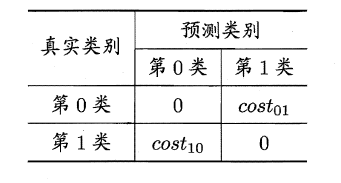

# 2.1误差与过拟合

## 2.1.1错误率&误差

- 错误率：错分样本的占比：E=a/m
- 误差：样本真实输出与预测输出之间的差异         
  
  训练(经验)误差：训练集上
  
  测试误差：测试集

       泛化误差：除训练集外所有样本

由于事先并不知道新样本的特征，我们只能努力使经验误差最小化；很多时候虽然能在训练集上做到分类错误率为零，但多数情况下这样的学习器并不好

## 2.1.2经验误差与过拟合

我们将学习器对样本的实际预测结果与样本的真实值之间的差异成为：误差（error）。定义：

- 在训练集上的误差称为训练误差（training error）或经验误差（empirical error）。
- 在测试集上的误差称为测试误差（test error）
- 学习器在所有新样本上的误差称为泛化误差（generalization error）。

显然，我们希望得到的是在新样本上表现得很好的学习器，即泛化误差小的学习器。因此，我们应该让学习器尽可能地从训练集中学出普适性的“一般特征”，这样在遇到新样本时才能做出正确的判别。然而，当学习器把训练集学得“太好”的时候，即把一些训练样本的自身特点当做了普遍特征；同时也有学习能力不足的情况，即训练集的基本特征都没有学习出来。我们定义：

- 学习能力过强，以至于把训练样本所包含的不太一般的特性都学到了，称为：过拟合（overfitting）。
- 学习能太差，训练样本的一般性质尚未学好，称为：欠拟合（underfitting）。

可以得知：在过拟合问题中，训练误差十分小，但测试误差教大；在欠拟合问题中，训练误差和测试误差都比较大。目前，欠拟合问题比较容易克服，例如增加迭代次数等，但过拟合问题还没有十分好的解决方案，过拟合是机器学习面临的关键障碍。

## 2.1.3评估方法

  现实任务中往往会对学习器的泛化性能、时间开销、存储开销、可解释性等方面的因素进行评估并做出选择。
    我们假设测试集是从样本真实分布中独立采样获得，将测试集上的“测试误差”作为泛化误差的近似，所以测试集要和训练集中的样本尽量互斥。

- [ ] 留出法：

- 直接将数据集划分为两个互斥集合
- 训练/测试集划分要尽可能保持数据分布的一致性
- 一般若干次随机划分、重复实验取平均值
- 训练/测试样本比例通常为2:1~4:1

- [ ] 交叉验证法：

- 将数据集分层采样划分为k个大小相似的互斥子集，每次用k-1个子
集的并集作为训练集，余下的子集作为测试集，最终返回k个测试
结果的均值，k最常用的取值是10.

与留出法类似，将数据集D划分为k个子集同样存在多种划分方式，为了减小因样本划分不同而引入的差别，k折交叉验证通常随机使用不同的划分重复p次，最终的评估结果是这p次k折交叉验证结果的均值，例如常见的“10次10折交叉验证“。

- [ ] 自助法：

- 实际模型与预期模型都使用 m个训练样本
- 约有1/3的样本没在训练集中出现
- 从初始数据集中产生多个不同的训练集，对集成学习有很大的
好处

自助法在数据集较小，难以有效划分训练集/测试集时很有用，但由于自助法产生的数据集（随机抽样）改变了初始数据集的分布，因此引入了估计偏差。在初始数据集足够时，留出法和交叉验证法更加常用。

# 2.1.4调参

大多数学习算法都有些参数(parameter) 需要设定，参数配置不同，学得模型的性能往往有显著差别，这就是通常所说的”参数调节”或简称”调参” (parameter tuning)。

学习算法的很多参数是在实数范围内取值，因此，对每种参数取值都训练出模型来是不可行的。常用的做法是：对每个参数选定一个范围和步长λ，这样使得学习的过程变得可行。例如：假定算法有3 个参数，每个参数仅考虑5 个候选值，这样对每一组训练/测试集就有555= 125 个模型需考察，

# 2.2性能度量

## 2.2.1最常见的性能度量

- “均方误差”（mean squared error）：
  
  在回归任务中，即预测连续值的问题，最常用的性能度量
  
   

在分类任务中，即预测离散值的问题，最常用的是错误率和精度，错误率是分类错误的样本数占样本总数的比例，精度则是分类正确的样本数占样本总数的比例，易知：错误率+精度=1。

## 2.2.2查准率/查全率/F1

分类结果混淆矩阵与查准/查全率定义:

“P-R曲线”是描述查准/查全率变化的曲线，P-R曲线定义如下：根据学习器的预测结果（一般为一个实值或概率）对测试样本进行排序，将最可能是“正例”的样本排在前面，最不可能是“正例”的排在后面，按此顺序逐个把样本作为“正例”进行预测，每次计算出当前的P值和R值，如下图所示:

若一个学习器A的P-R曲线被另一个学习器B的P-R曲线完全包住，则称：B的性能优于A。若A和B的曲线发生了交叉，则谁的曲线下的面积大，谁的性能更优。但一般来说，曲线下的面积是很难进行估算的，所以衍生出了“平衡点”（Break-Event Point，简称BEP），即当P=R时的取值，平衡点的取值越高，性能更优。

P和R指标有时会出现矛盾的情况，这样就需要综合考虑他们，最常见的方法就是F-Measure，又称F-Score。F-Measure是P和R的加权调和平均，即：

特别地，当β=1时，也就是常见的F1度量，是P和R的调和平均，当F1较高时，模型的性能越好。

有时候我们会有多个二分类混淆矩阵，例如：多次训练或者在多个数据集上训练，那么估算全局性能的方法有两种，分为宏观和微观。简单理解，宏观就是先算出每个混淆矩阵的P值和R值，然后取得平均P值macro-P和平均R值macro-R，在算出Fβ或F1，而微观则是计算出混淆矩阵的平均TP、FP、TN、FN，接着进行计算P、R，进而求出Fβ或F1。

## 2.2.3ROC与AUC

学习器对测试样本的评估结果一般为一个实值或概率，设定一个阈值，大于阈值为正例，小于阈值为负例，因此这个实值的好坏直接决定了学习器的泛化性能，若将这些实值排序，则排序的好坏决定了学习器的性能高低。ROC曲线正是从这个角度出发来研究学习器的泛化性能，ROC曲线与P-R曲线十分类似，都是按照排序的顺序逐一按照正例预测，不同的是ROC曲线以“真正例率”（True Positive Rate，简称TPR）为横轴，纵轴为“假正例率”（False Positive Rate，简称FPR），ROC偏重研究基于测试样本评估值的排序好坏。

简单分析图像，可以得知：当FN=0时，TN也必须0，反之也成立，我们可以画一个队列，试着使用不同的截断点（即阈值）去分割队列，来分析曲线的形状，（0,0）表示将所有的样本预测为负例，（1,1）则表示将所有的样本预测为正例，（0,1）表示正例全部出现在负例之前的理想情况，（1,0）则表示负例全部出现在正例之前的最差情况。

同样地，进行模型的性能比较时，若一个学习器A的ROC曲线被另一个学习器B的ROC曲线完全包住，则称B的性能优于A。若A和B的曲线发生了交叉，则谁的曲线下的面积大，谁的性能更优。ROC曲线下的面积定义为AUC（Area Uder ROC Curve），不同于P-R的是，这里的AUC是可估算的，即AUC曲线下每一个小矩形的面积之和。易知：AUC越大，证明排序的质量越好，AUC为1时，证明所有正例排在了负例的前面，AUC为0时，所有的负例排在了正例的前面。

## 2.2.4代价敏感错误率与代价曲线

上面的方法中，将学习器的犯错同等对待，但在现实生活中，将正例预测成假例与将假例预测成正例的代价常常是不一样的，例如：将无疾病—>有疾病只是增多了检查，但有疾病—>无疾病却是增加了生命危险。以二分类为例，由此引入了“代价矩阵”（cost matrix）。

在非均等错误代价下，我们希望的是最小化“总体代价”，这样“代价敏感”的错误率（2.2.1节介绍）为：

同样对于ROC曲线，在非均等错误代价下，演变成了“代价曲线”，代价曲线横轴是取值在[0,1]之间的正例概率代价，式中p表示正例的概率，纵轴是取值为[0,1]的归一化代价。

代价曲线的绘制很简单：设ROC曲线上一点的坐标为(TPR，FPR) ，则可相应计算出FNR，然后在代价平面上绘制一条从(0，FPR) 到(1，FNR) 的线段，线段下的面积即表示了该条件下的期望总体代价；如此将ROC 曲线土的每个点转化为代价平面上的一条线段，然后取所有线段的下界，围成的面积即为在所有条件下学习器的期望总体代价，如图所示：

# 2.3比较检验

由于“测试误差”受到很多因素的影响，例如：算法随机性(例如常见的K-Means)或测试集本身的选择，使得同一模型每次得到的结果不尽相同，同时测试误差是作为泛化误差的近似，并不能代表学习器真实的泛化性能，那如何对单个或多个学习器在不同或相同测试集上的性能度量结果做比较呢？这就是比较检验。最后偏差与方差是解释学习器泛化性能的一种重要工具。

## 2.3.1比较检验

在比较学习器泛化性能的过程中，统计假设检验（hypothesis test）为学习器性能比较提供了重要依据，即若A在某测试集上的性能优于B，那A学习器比B好的把握有多大。 为方便论述，以“错误率”作为性能度量的标准。

## 2.3.2假设检验

“假设”指的是对样本总体的分布或已知分布中某个参数值的一种猜想，例如：假设总体服从泊松分布，或假设正态总体的期望u=u0。我们可以通过测试获得测试错误率，但直观上测试错误率和泛化错误率相差不会太远，因此可以通过测试错误率来推测泛化错误率的分布，这就是一种假设检验。

## 2.3.3交叉验证t检验

## 2.3.4McNemar检验

MaNemar主要用于二分类问题，与成对t检验一样也是用于比较两个学习器的性能大小。主要思想是：若两学习器的性能相同，则A预测正确B预测错误数应等于B预测错误A预测正确数，即e01=e10，且|e01-e10|服从N（1，e01+e10）分布。

因此，如下所示的变量服从自由度为1的卡方分布，即服从标准正态分布N（0,1）的随机变量的平方和，下式只有一个变量，故自由度为1，检验的方法同上：做出假设—>求出满足显著度的临界点—>给出拒绝域—>验证假设。

## 2.3.5Friedman检验与Nemenyi后续检验

上述的三种检验都只能在一组数据集上，F检验则可以在多组数据集进行多个学习器性能的比较，基本思想是在同一组数据集上，根据测试结果（例：测试错误率）对学习器的性能进行排序，赋予序值1,2,3…，相同则平分序值，如下图所示：

若学习器的性能相同，则它们的平均序值应该相同，且第i个算法的平均序值ri服从正态分布N（（k+1）/2，（k+1）(k-1)/12），则有：

服从自由度为k-1和(k-1)(N-1)的F分布。下面是F检验常用的临界值：

若“H0：所有算法的性能相同”这个假设被拒绝，则需要进行后续检验，来得到具体的算法之间的差异。常用的就是Nemenyi后续检验。Nemenyi检验计算出平均序值差别的临界值域，下表是常用的qa值，若两个算法的平均序值差超出了临界值域CD，则相应的置信度1-α拒绝“两个算法性能相同”的假设。

# 2.3.6偏差与方差

偏差-方差分解是解释学习器泛化性能的重要工具。在学习算法中，偏差指的是预测的期望值与真实值的偏差，方差则是每一次预测值与预测值得期望之间的差均方。实际上，偏差体现了学习器预测的准确度，而方差体现了学习器预测的稳定性。通过对泛化误差的进行分解，可以得到：

- 期望泛化误差 = 方差+偏差
- 偏差刻画学习器的拟合能力
- 方差体现学习器的稳定性

易知：方差和偏差具有矛盾性，这就是常说的偏差-方差窘境（bias-variance dilamma），随着训练程度的提升，期望预测值与真实值之间的差异越来越小，即偏差越来越小，但是另一方面，随着训练程度加大，学习算法对数据集的波动越来越敏感，方差值越来越大。换句话说：在欠拟合时，偏差主导泛化误差，而训练到一定程度后，偏差越来越小，方差主导了泛化误差。因此训练也不要贪杯，适度辄止。

