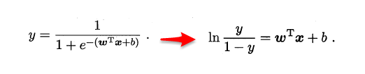

# 3.1线性回归

线性回归问题就是试图学到一个线性模型尽可能准确地预测新样本的输出值。

有时这些输入的属性值并不能直接被我们的学习模型所用，需要进行相应的处理，对于连续值的属性，一般都可以被学习器所用，有时会根据具体的情形作相应的预处理，例如：归一化等；对于离散值的属性，可作下面的处理：

- 若属性值之间存在“序关系”，则可以将其转化为连续值，例如：身高属性分为“高”“中等”“矮”，可转化为数值：{1， 0.5， 0}。
- 若属性值之间不存在“序关系”，则通常将其转化为向量的形式，例如：性别属性分为“男”“女”，可转化为二维向量：{（1，0），（0，1）}。

（1）当输入属性只有一个的时候，就是最简单的情形，也就是我们高中时最熟悉的“最小二乘法”（Euclidean distance），首先计算出每个样本预测值与真实值之间的误差并求和，通过最小化均方误差MSE，使用求偏导等于零的方法计算出拟合直线y=wx+b的两个参数w和b，计算过程如下图所示：

（2）当输入属性有多个的时候，例如对于一个样本有d个属性{（x1,x2…xd）,y}，则y=wx+b需要写成：

通常对于多元问题，常常使用矩阵的形式来表示数据。在本问题中，将具有m个样本的数据集表示成矩阵X，将系数w与b合并成一个列向量，这样每个样本的预测值以及所有样本的均方误差最小化就可以写成下面的形式：

同样地，我们使用最小二乘法对w和b进行估计，令均方误差的求导等于0，需要注意的是，当一个矩阵的行列式不等于0时，我们才可能对其求逆，因此对于下式，我们需要考虑矩阵（X的转置*X）的行列式是否为0，若不为0，则可以求出其解，若为0，则需要使用其它的方法进行计算，书中提到了引入正则化，此处不进行深入。

同样地，我们使用最小二乘法对w和b进行估计，令均方误差的求导等于0，需要注意的是，当一个矩阵的行列式不等于0时，我们才可能对其求逆，因此对于下式，我们需要考虑矩阵（X的转置*X）的行列式是否为0，若不为0，则可以求出其解，若为0，则需要使用其它的方法进行计算，书中提到了引入正则化，此处不进行深入。

另一方面，有时像上面这种原始的线性回归可能并不能满足需求，例如：y值并不是线性变化，而是在指数尺度上变化。这时我们可以采用线性模型来逼近y的衍生物，例如lny，这时衍生的线性模型如下所示，实际上就是相当于将指数曲线投影在一条直线上，如下图所示：

更一般地，考虑所有y的衍生物的情形，就得到了“广义的线性模型”（generalized linear model），其中，g（*）称为联系函数（link function）。

# 3.2线性几率回归（逻辑回归）

回归就是通过输入的属性值得到一个预测值，利用上述广义线性模型的特征，是否可以通过一个联系函数，将预测值转化为离散值从而进行分类呢？线性几率回归正是研究这样的问题。对数几率引入了一个对数几率函数（logistic function）,将预测值投影到0-1之间，从而将线性回归问题转化为二分类问题。

若将y看做样本为正例的概率，（1-y）看做样本为反例的概率，则上式实际上使用线性回归模型的预测结果器逼近真实标记的对数几率。因此这个模型称为“对数几率回归”（logistic regression），也有一些书籍称之为“逻辑回归”。下面使用最大似然估计的方法来计算出w和b两个参数的取值，下面只列出求解的思路，不列出具体的计算过程。

# 线性判别分析

线性判别分析（Linear Discriminant Analysis，简称LDA）,其基本思想是：将训练样本投影到一条直线上，使得同类的样例尽可能近，不同类的样例尽可能远。如图所示：

想让同类样本点的投影点尽可能接近，不同类样本点投影之间尽可能远，即：让各类的协方差之和尽可能小，不同类之间中心的距离尽可能大。基于这样的考虑，LDA定义了两个散度矩阵。

- 类内散度矩阵(within-class scatter matrix)

- 类间散度矩阵

因此得到了LDA的最大化目标：“广义瑞利商”（generalized Rayleigh quotient）。

从而分类问题转化为最优化求解w的问题，当求解出w后，对新的样本进行分类时，只需将该样本点投影到这条直线上，根据与各个类别的中心值进行比较，从而判定出新样本与哪个类别距离最近。求解w的方法如下所示，使用的方法为λ乘子。

若将w看做一个投影矩阵，类似PCA的思想，则LDA可将样本投影到N-1维空间（N为类簇数），投影的过程使用了类别信息（标记信息），因此LDA也常被视为一种经典的监督降维技术。​

# 多分类技术

现实中我们经常遇到不只两个类别的分类问题，即多分类问题，在这种情形下，我们常常运用“拆分”的策略，通过多个二分类学习器来解决多分类问题，即将多分类问题拆解为多个二分类问题，训练出多个二分类学习器，最后将多个分类结果进行集成得出结论。最为经典的拆分策略有三种：“一对一”（OvO）、“一对其余”（OvR）和“多对多”（MvM），核心思想与示意图如下所示。

- OvO：给定数据集D，假定其中有N个真实类别，将这N个类别进行两两配对（一个正类/一个反类），从而产生N（N-1）/2个二分类学习器，在测试阶段，将新样本放入所有的二分类学习器中测试，得出N（N-1）个结果，最终通过投票产生最终的分类结果。
- OvM：给定数据集D，假定其中有N个真实类别，每次取出一个类作为正类，剩余的所有类别作为一个新的反类，从而产生N个二分类学习器，在测试阶段，得出N个结果，若仅有一个学习器预测为正类，则对应的类标作为最终分类结果。
- MvM：给定数据集D，假定其中有N个真实类别，每次取若干个类作为正类，若干个类作为反类（通过ECOC码给出，编码），若进行了M次划分，则生成了M个二分类学习器，在测试阶段（解码），得出M个结果组成一个新的码，最终通过计算海明/欧式距离选择距离最小的类别作为最终分类结果。
- 

# 类别不平衡问题

类别不平衡（class-imbanlance）就是指分类问题中不同类别的训练样本相差悬殊的情况，例如正例有900个，而反例只有100个，这个时候我们就需要进行相应的处理来平衡这个问题。常见的做法有三种：

1. 在训练样本较多的类别中进行“欠采样”（undersampling）,比如从正例中采出100个，常见的算法有：EasyEnsemble。
2. 在训练样本较少的类别中进行“过采样”（oversampling）,例如通过对反例中的数据进行插值，来产生额外的反例，常见的算法有SMOTE。
3. 直接基于原数据集进行学习，对预测值进行“再缩放”处理。其中再缩放也是代价敏感学习的基础。

# Python里的线性回归模型函数

线性回归模型在Python第三方模块 sklearn 模块下的 linear_model 模块中。使用时先进行导入。

线性回归建模的函数为： sklearn.linear_model.LinearRegression

