# 4.1决策层数基本概念

- 决策树是基于树结构来进行决策的

# 4.2决策树的构造

决策树的构造是一个递归的过程，有三种情形会导致递归返回：(1) 当前结点包含的样本全属于同一类别，这时直接将该节点标记为叶节点，并设为相应的类别；(2) 当前属性集为空，或是所有样本在所有属性上取值相同，无法划分，这时将该节点标记为叶节点，并将其类别设为该节点所含样本最多的类别；(3) 当前结点包含的样本集合为空，不能划分，这时也将该节点标记为叶节点，并将其类别设为父节点中所含样本最多的类别。算法的基本流程如下图所示：

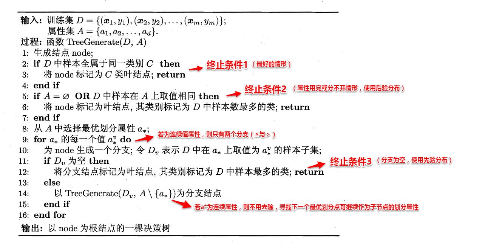

可以看出：决策树学习的关键在于如何选择划分属性，不同的划分属性得出不同的分支结构，从而影响整颗决策树的性能。属性划分的目标是让各个划分出来的子节点尽可能地“纯”，即属于同一类别。因此下面便是介绍量化纯度的具体方法，决策树最常用的算法有三种：ID3，C4.5和CART。

## 4.2.1ID3算法

ID3算法使用信息增益为准则来选择划分属性，“信息熵”(information entropy)是度量样本结合纯度的常用指标，假定当前样本集合D中第k类样本所占比例为pk，则样本集合D的信息熵定义为

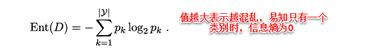

假定通过属性划分样本集D，产生了V个分支节点，v表示其中第v个分支节点，易知：分支节点包含的样本数越多，表示该分支节点的影响力越大。故可以计算出划分后相比原始数据集D获得的“信息增益”（information gain）。

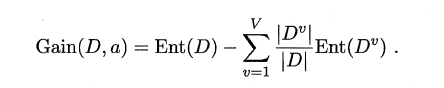

信息增益越大，表示使用该属性划分样本集D的效果越好，因此ID3算法在递归过程中，每次选择最大信息增益的属性作为当前的划分属性。

## C4.5算法

CART决策树使用“基尼指数”（Gini index）来选择划分属性，基尼指数反映的是从样本集D中随机抽取两个样本，其类别标记不一致的概率，因此Gini(D)越小越好，基尼指数定义如下：


进而，使用属性α划分后的基尼指数为：

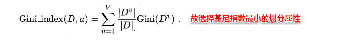

# 4.3剪枝处理

从决策树的构造流程中我们可以直观地看出：不管怎么样的训练集，决策树总是能很好地将各个类别分离开来，这时就会遇到之前提到过的问题：过拟合（overfitting），即太依赖于训练样本。剪枝（pruning）则是决策树算法对付过拟合的主要手段，剪枝的策略有两种如下：

```python
* 预剪枝（prepruning）：在构造的过程中先评估，再考虑是否分支。
* 后剪枝（post-pruning）：在构造好一颗完整的决策树后，自底向上，评估分支的必要性。
```

评估指的是性能度量，即决策树的泛化性能。之前提到：可以使用测试集作为学习器泛化性能的近似，因此可以将数据集划分为训练集和测试集。预剪枝表示在构造数的过程中，对一个节点考虑是否分支时，首先计算决策树不分支时在测试集上的性能，再计算分支之后的性能，若分支对性能没有提升，则选择不分支（即剪枝）。后剪枝则表示在构造好一颗完整的决策树后，从最下面的节点开始，考虑该节点分支对模型的性能是否有提升，若无则剪枝，即将该节点标记为叶子节点，类别标记为其包含样本最多的类别。

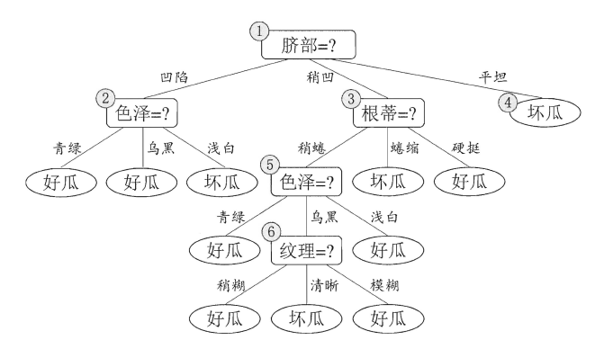

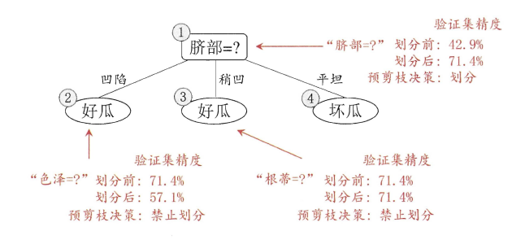

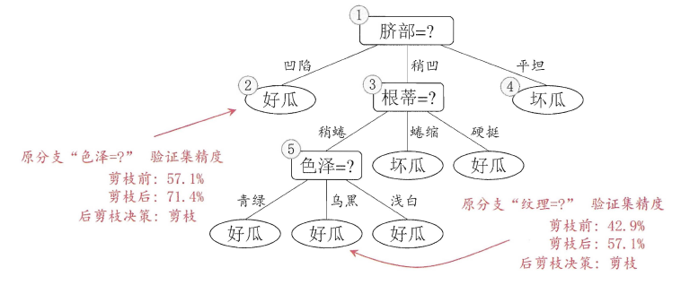

上图分别表示不剪枝处理的决策树、预剪枝决策树和后剪枝决策树。预剪枝处理使得决策树的很多分支被剪掉，因此大大降低了训练时间开销，同时降低了过拟合的风险，但另一方面由于剪枝同时剪掉了当前节点后续子节点的分支，因此预剪枝“贪心”的本质阻止了分支的展开，在一定程度上带来了欠拟合的风险。而后剪枝则通常保留了更多的分支，因此采用后剪枝策略的决策树性能往往优于预剪枝，但其自底向上遍历了所有节点，并计算性能，训练时间开销相比预剪枝大大提升。

# 4.4连续值与缺失值

对于连续值的属性，若每个取值作为一个分支则显得不可行，因此需要进行离散化处理，常用的方法为二分法，基本思想为：给定样本集D与连续属性α，二分法试图找到一个划分点t将样本集D在属性α上分为≤t与＞t。

```
* 首先将α的所有取值按升序排列，所有相邻属性的均值作为候选划分点（n-1个，n为α所有的取值数目）。
* 计算每一个划分点划分集合D（即划分为两个分支）后的信息增益。
* 选择最大信息增益的划分点作为最优划分点。
```

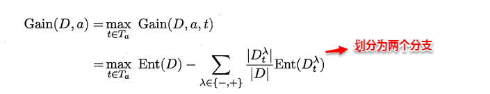

现实中常会遇到不完整的样本，即某些属性值缺失。有时若简单采取剔除，则会造成大量的信息浪费，因此在属性值缺失的情况下需要解决两个问题：（1）如何选择划分属性。（2）给定划分属性，若某样本在该属性上缺失值，如何划分到具体的分支上。假定为样本集中的每一个样本都赋予一个权重，根节点中的权重初始化为1，则定义：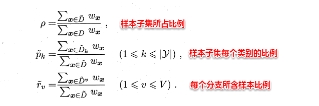

对于（1）：通过在样本集D中选取在属性α上没有缺失值的样本子集，计算在该样本子集上的信息增益，最终的信息增益等于该样本子集划分后信息增益乘以样本子集占样本集的比重。即：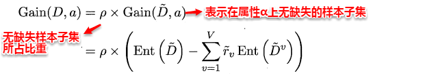

对于（2）：若该样本子集在属性α上的值缺失，则将该样本以不同的权重（即每个分支所含样本比例）划入到所有分支节点中。该样本在分支节点中的权重变为：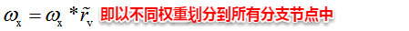

# 多变量决策树

- [ ] 单变量决策树分类边界：轴平行
- [ ] 多变量决策树

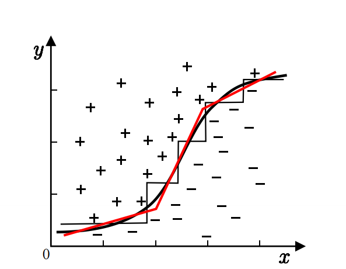

- 非叶节点不再是仅对某个属性,而是对属性的线性组合

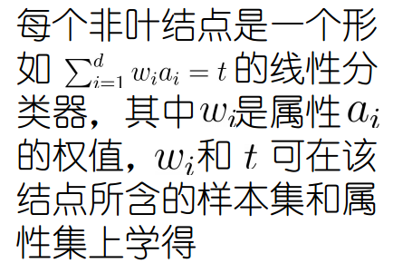