# 7.1贝叶斯分类器

贝叶斯分类器是一种概率框架下的统计学习分类器，对分类任务而言，假设在相关概率都已知的情况下，贝叶斯分类器考虑如何基于这些概率为样本判定最优的类标。在开始介绍贝叶斯决策论之前，我们首先来回顾下概率论委员会常委—贝叶斯公式。

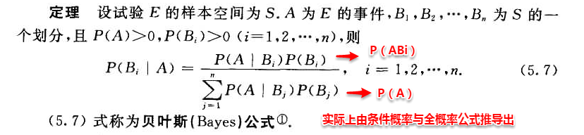

# 7.2贝叶斯决策论

若将上述定义中样本空间的划分Bi看做为类标，A看做为一个新的样本，则很容易将条件概率理解为样本A是类别Bi的概率。在机器学习训练模型的过程中，往往我们都试图去优化一个风险函数，因此在概率框架下我们也可以为贝叶斯定义“条件风险”（conditional risk）。

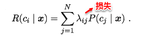

我们的任务就是寻找一个判定准则最小化所有样本的条件风险总和，因此就有了贝叶斯判定准则（Bayes decision rule）:为最小化总体风险，只需在每个样本上选择那个使得条件风险最小的类标。

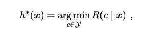

若损失函数λ取0-1损失，则有：

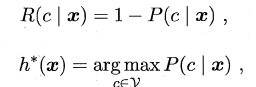

即对于每个样本x，选择其后验概率P（c | x）最大所对应的类标，能使得总体风险函数最小，从而将原问题转化为估计后验概率P（c | x）。一般这里有两种策略来对后验概率进行估计：

```
* 判别式模型：直接对 P（c | x）进行建模求解。例我们前面所介绍的决策树、神经网络、SVM都是属于判别式模型。
* 生成式模型：通过先对联合分布P（x,c）建模，从而进一步求解 P（c | x）。
```

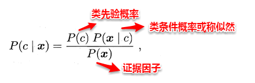

对于给定的样本x，P（x）与类标无关，P（c）称为类先验概率，p（x | c ）称为类条件概率。这时估计后验概率P（c | x）就变成为估计类先验概率和类条件概率的问题。对于先验概率和后验概率，在看这章之前也是模糊了我好久，这里普及一下它们的基本概念。

```
* 先验概率： 根据以往经验和分析得到的概率。
* 后验概率：后验概率是基于新的信息，修正原来的先验概率后所获得的更接近实际情况的概率估计。
```

实际上先验概率就是在没有任何结果出来的情况下估计的概率，而后验概率则是在有一定依据后的重新估计，直观意义上后验概率就是条件概率。下面直接上Wiki上的一个例子，简单粗暴快速完事…

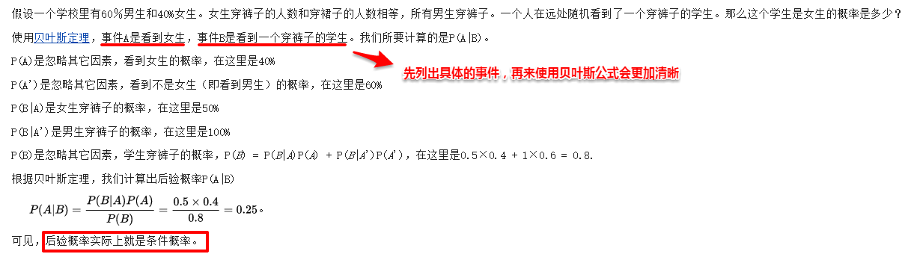

回归正题，对于类先验概率P（c），p（c）就是样本空间中各类样本所占的比例，根据大数定理（当样本足够多时，频率趋于稳定等于其概率），这样当训练样本充足时，p(c)可以使用各类出现的频率来代替。因此只剩下类条件概率p（x | c ），它表达的意思是在类别c中出现x的概率，它涉及到属性的联合概率问题，若只有一个离散属性还好，当属性多时采用频率估计起来就十分困难，因此这里一般采用极大似然法进行估计。

# 7.3极大似然法

极大似然估计（Maximum Likelihood Estimation，简称MLE），是一种根据数据采样来估计概率分布的经典方法。常用的策略是先假定总体具有某种确定的概率分布，再基于训练样本对概率分布的参数进行估计。运用到类条件概率p（x | c ）中，假设p（x | c ）服从一个参数为θ的分布，问题就变为根据已知的训练样本来估计θ。极大似然法的核心思想就是：估计出的参数使得已知样本出现的概率最大，即使得训练数据的似然最大。

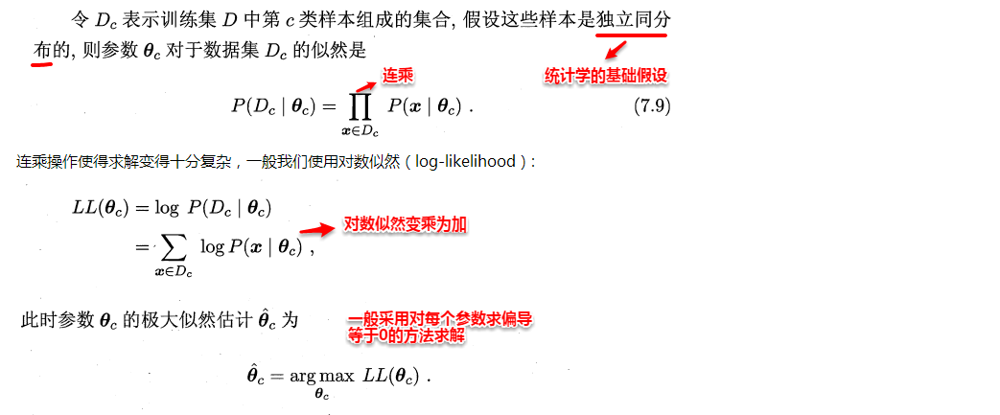

所以，贝叶斯分类器的训练过程就是参数估计。总结最大似然法估计参数的过程，一般分为以下四个步骤：

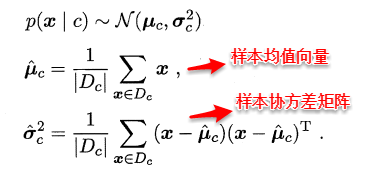

# 7.4朴素贝叶斯分类器

不难看出：原始的贝叶斯分类器最大的问题在于联合概率密度函数的估计，首先需要根据经验来假设联合概率分布，其次当属性很多时，训练样本往往覆盖不够，参数的估计会出现很大的偏差。为了避免这个问题，朴素贝叶斯分类器（naive Bayes classifier）采用了“属性条件独立性假设”，即样本数据的所有属性之间相互独立。这样类条件概率p（x | c ）可以改写为：

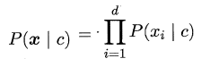

这样，为每个样本估计类条件概率变成为每个样本的每个属性估计类条件概率。

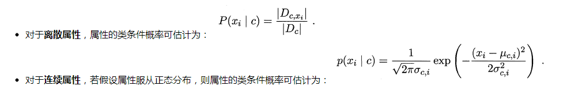

相比原始贝叶斯分类器，朴素贝叶斯分类器基于单个的属性计算类条件概率更加容易操作，需要注意的是：若某个属性值在训练集中和某个类别没有一起出现过，这样会抹掉其它的属性信息，因为该样本的类条件概率被计算为0。因此在估计概率值时，常常用进行平滑（smoothing）处理，拉普拉斯修正（Laplacian correction）就是其中的一种经典方法，具体计算方法如下：

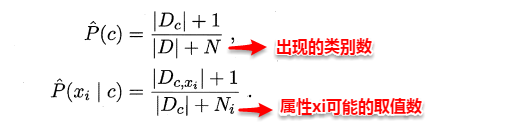

当训练集越大时，拉普拉斯修正引入的影响越来越小。对于贝叶斯分类器，模型的训练就是参数估计，因此可以事先将所有的概率储存好，当有新样本需要判定时，直接查表计算即可。
